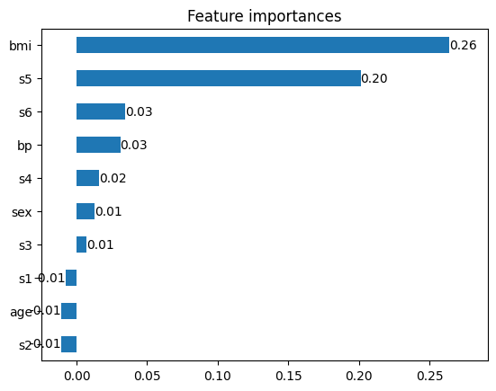
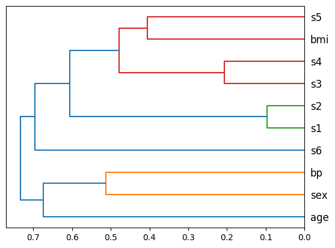

Model Inspector
================

<!-- WARNING: THIS FILE WAS AUTOGENERATED! DO NOT EDIT! -->

`model_inspector` aims to help you train better `scikit-learn` models by
providing insights into their behavior.

## Use

To use `model_inspector`, you create an `Inspector` object from a
`scikit-learn` model, a feature DataFrame `X`, and a target Series `y`.
Typically you will want to create it on held-out data, as shown below.

``` python
import sklearn.datasets
from sklearn.ensemble import RandomForestRegressor
from sklearn.model_selection import train_test_split

from model_inspector import get_inspector
```

``` python
X, y = sklearn.datasets.load_diabetes(return_X_y=True, as_frame=True)
```

``` python
X
```

<div>
<style scoped>
    .dataframe tbody tr th:only-of-type {
        vertical-align: middle;
    }

    .dataframe tbody tr th {
        vertical-align: top;
    }

    .dataframe thead th {
        text-align: right;
    }
</style>
<table border="1" class="dataframe">
  <thead>
    <tr style="text-align: right;">
      <th></th>
      <th>age</th>
      <th>sex</th>
      <th>bmi</th>
      <th>bp</th>
      <th>s1</th>
      <th>s2</th>
      <th>s3</th>
      <th>s4</th>
      <th>s5</th>
      <th>s6</th>
    </tr>
  </thead>
  <tbody>
    <tr>
      <th>0</th>
      <td>0.038076</td>
      <td>0.050680</td>
      <td>0.061696</td>
      <td>0.021872</td>
      <td>-0.044223</td>
      <td>-0.034821</td>
      <td>-0.043401</td>
      <td>-0.002592</td>
      <td>0.019907</td>
      <td>-0.017646</td>
    </tr>
    <tr>
      <th>1</th>
      <td>-0.001882</td>
      <td>-0.044642</td>
      <td>-0.051474</td>
      <td>-0.026328</td>
      <td>-0.008449</td>
      <td>-0.019163</td>
      <td>0.074412</td>
      <td>-0.039493</td>
      <td>-0.068332</td>
      <td>-0.092204</td>
    </tr>
    <tr>
      <th>2</th>
      <td>0.085299</td>
      <td>0.050680</td>
      <td>0.044451</td>
      <td>-0.005670</td>
      <td>-0.045599</td>
      <td>-0.034194</td>
      <td>-0.032356</td>
      <td>-0.002592</td>
      <td>0.002861</td>
      <td>-0.025930</td>
    </tr>
    <tr>
      <th>3</th>
      <td>-0.089063</td>
      <td>-0.044642</td>
      <td>-0.011595</td>
      <td>-0.036656</td>
      <td>0.012191</td>
      <td>0.024991</td>
      <td>-0.036038</td>
      <td>0.034309</td>
      <td>0.022688</td>
      <td>-0.009362</td>
    </tr>
    <tr>
      <th>4</th>
      <td>0.005383</td>
      <td>-0.044642</td>
      <td>-0.036385</td>
      <td>0.021872</td>
      <td>0.003935</td>
      <td>0.015596</td>
      <td>0.008142</td>
      <td>-0.002592</td>
      <td>-0.031988</td>
      <td>-0.046641</td>
    </tr>
    <tr>
      <th>...</th>
      <td>...</td>
      <td>...</td>
      <td>...</td>
      <td>...</td>
      <td>...</td>
      <td>...</td>
      <td>...</td>
      <td>...</td>
      <td>...</td>
      <td>...</td>
    </tr>
    <tr>
      <th>437</th>
      <td>0.041708</td>
      <td>0.050680</td>
      <td>0.019662</td>
      <td>0.059744</td>
      <td>-0.005697</td>
      <td>-0.002566</td>
      <td>-0.028674</td>
      <td>-0.002592</td>
      <td>0.031193</td>
      <td>0.007207</td>
    </tr>
    <tr>
      <th>438</th>
      <td>-0.005515</td>
      <td>0.050680</td>
      <td>-0.015906</td>
      <td>-0.067642</td>
      <td>0.049341</td>
      <td>0.079165</td>
      <td>-0.028674</td>
      <td>0.034309</td>
      <td>-0.018114</td>
      <td>0.044485</td>
    </tr>
    <tr>
      <th>439</th>
      <td>0.041708</td>
      <td>0.050680</td>
      <td>-0.015906</td>
      <td>0.017293</td>
      <td>-0.037344</td>
      <td>-0.013840</td>
      <td>-0.024993</td>
      <td>-0.011080</td>
      <td>-0.046883</td>
      <td>0.015491</td>
    </tr>
    <tr>
      <th>440</th>
      <td>-0.045472</td>
      <td>-0.044642</td>
      <td>0.039062</td>
      <td>0.001215</td>
      <td>0.016318</td>
      <td>0.015283</td>
      <td>-0.028674</td>
      <td>0.026560</td>
      <td>0.044529</td>
      <td>-0.025930</td>
    </tr>
    <tr>
      <th>441</th>
      <td>-0.045472</td>
      <td>-0.044642</td>
      <td>-0.073030</td>
      <td>-0.081413</td>
      <td>0.083740</td>
      <td>0.027809</td>
      <td>0.173816</td>
      <td>-0.039493</td>
      <td>-0.004222</td>
      <td>0.003064</td>
    </tr>
  </tbody>
</table>
<p>442 rows × 10 columns</p>
</div>

``` python
y
```

    0      151.0
    1       75.0
    2      141.0
    3      206.0
    4      135.0
           ...  
    437    178.0
    438    104.0
    439    132.0
    440    220.0
    441     57.0
    Name: target, Length: 442, dtype: float64

``` python
X_train, X_test, y_train, y_test = train_test_split(X, y)
```

``` python
rfr = RandomForestRegressor().fit(X_train, y_train)
```

``` python
rfr.score(X_test, y_test)
```

    0.49419363561131635

``` python
inspector = get_inspector(rfr, X_test, y_test)
```

You can then use various methods of `inspector` to learn about how your
model behaves on that data.

The methods that are available for a given inspector depends on the
types of its estimator and its target `y`. An attribute called `methods`
tells you what they are:

``` python
inspector.methods
```

    ['permutation_importance',
     'plot_feature_clusters',
     'plot_partial_dependence',
     'plot_permutation_importance',
     'plot_pred_vs_act',
     'plot_residuals',
     'show_correlation']

``` python
inspector.permutation_importance()
```

    bmi    0.253263
    s5     0.216381
    bp     0.041223
    s6     0.038466
    s4     0.011436
    s3     0.009732
    sex    0.008383
    s1    -0.004575
    s2    -0.012520
    age   -0.014762
    dtype: float64

``` python
ax = inspector.plot_permutation_importance()
```



``` python
most_important_features = inspector.permutation_importance().index[:2]
axes = inspector.plot_partial_dependence(
    features=[*most_important_features, most_important_features]
)
axes[0, 0].get_figure().set_size_inches(12, 3)
```


``` python
inspector.show_correlation()
```

<style type="text/css">
#T_ccf74_row0_col0, #T_ccf74_row1_col1, #T_ccf74_row2_col2, #T_ccf74_row3_col3, #T_ccf74_row4_col4, #T_ccf74_row5_col5, #T_ccf74_row6_col6, #T_ccf74_row7_col7, #T_ccf74_row8_col8, #T_ccf74_row9_col9, #T_ccf74_row10_col10 {
  background-color: #ff0000;
  color: #f1f1f1;
}
#T_ccf74_row0_col1, #T_ccf74_row1_col0 {
  background-color: #ffbaba;
  color: #000000;
}
#T_ccf74_row0_col2, #T_ccf74_row2_col0 {
  background-color: #ffc8c8;
  color: #000000;
}
#T_ccf74_row0_col3, #T_ccf74_row3_col0, #T_ccf74_row7_col9, #T_ccf74_row9_col7 {
  background-color: #ffaaaa;
  color: #000000;
}
#T_ccf74_row0_col4, #T_ccf74_row4_col0 {
  background-color: #ffc4c4;
  color: #000000;
}
#T_ccf74_row0_col5, #T_ccf74_row5_col0 {
  background-color: #ffb6b6;
  color: #000000;
}
#T_ccf74_row0_col6, #T_ccf74_row6_col0 {
  background-color: #e0e0ff;
  color: #000000;
}
#T_ccf74_row0_col7, #T_ccf74_row7_col0 {
  background-color: #ffc6c6;
  color: #000000;
}
#T_ccf74_row0_col8, #T_ccf74_row8_col0 {
  background-color: #ffdede;
  color: #000000;
}
#T_ccf74_row0_col9, #T_ccf74_row3_col4, #T_ccf74_row4_col3, #T_ccf74_row9_col0 {
  background-color: #ffbebe;
  color: #000000;
}
#T_ccf74_row0_col10, #T_ccf74_row1_col10, #T_ccf74_row10_col0, #T_ccf74_row10_col1 {
  background-color: #ffd0d0;
  color: #000000;
}
#T_ccf74_row1_col2, #T_ccf74_row2_col1 {
  background-color: #ffcaca;
  color: #000000;
}
#T_ccf74_row1_col3, #T_ccf74_row2_col7, #T_ccf74_row3_col1, #T_ccf74_row7_col2 {
  background-color: #ff8a8a;
  color: #000000;
}
#T_ccf74_row1_col4, #T_ccf74_row4_col1 {
  background-color: #ffecec;
  color: #000000;
}
#T_ccf74_row1_col5, #T_ccf74_row5_col1 {
  background-color: #ffcece;
  color: #000000;
}
#T_ccf74_row1_col6, #T_ccf74_row6_col1 {
  background-color: #9898ff;
  color: #f1f1f1;
}
#T_ccf74_row1_col7, #T_ccf74_row7_col1, #T_ccf74_row8_col9, #T_ccf74_row9_col8 {
  background-color: #ffa2a2;
  color: #000000;
}
#T_ccf74_row1_col8, #T_ccf74_row8_col1 {
  background-color: #ffc2c2;
  color: #000000;
}
#T_ccf74_row1_col9, #T_ccf74_row9_col1 {
  background-color: #ffd6d6;
  color: #000000;
}
#T_ccf74_row2_col3, #T_ccf74_row3_col2 {
  background-color: #ff9696;
  color: #000000;
}
#T_ccf74_row2_col4, #T_ccf74_row4_col2 {
  background-color: #ffb2b2;
  color: #000000;
}
#T_ccf74_row2_col5, #T_ccf74_row5_col2 {
  background-color: #ffa6a6;
  color: #000000;
}
#T_ccf74_row2_col6, #T_ccf74_row6_col2 {
  background-color: #9a9aff;
  color: #f1f1f1;
}
#T_ccf74_row2_col8, #T_ccf74_row8_col2 {
  background-color: #ff7a7a;
  color: #f1f1f1;
}
#T_ccf74_row2_col9, #T_ccf74_row9_col2 {
  background-color: #ff9898;
  color: #000000;
}
#T_ccf74_row2_col10, #T_ccf74_row10_col2 {
  background-color: #ff5a5a;
  color: #f1f1f1;
}
#T_ccf74_row3_col5, #T_ccf74_row5_col3 {
  background-color: #ffbcbc;
  color: #000000;
}
#T_ccf74_row3_col6, #T_ccf74_row6_col3 {
  background-color: #c8c8ff;
  color: #000000;
}
#T_ccf74_row3_col7, #T_ccf74_row4_col9, #T_ccf74_row5_col9, #T_ccf74_row7_col3, #T_ccf74_row9_col4, #T_ccf74_row9_col5 {
  background-color: #ffb8b8;
  color: #000000;
}
#T_ccf74_row3_col8, #T_ccf74_row8_col3 {
  background-color: #ff9e9e;
  color: #000000;
}
#T_ccf74_row3_col9, #T_ccf74_row9_col3 {
  background-color: #ffa8a8;
  color: #000000;
}
#T_ccf74_row3_col10, #T_ccf74_row10_col3 {
  background-color: #ff8e8e;
  color: #000000;
}
#T_ccf74_row4_col5, #T_ccf74_row5_col4 {
  background-color: #ff1818;
  color: #f1f1f1;
}
#T_ccf74_row4_col6, #T_ccf74_row6_col4 {
  background-color: #ffeaea;
  color: #000000;
}
#T_ccf74_row4_col7, #T_ccf74_row7_col4 {
  background-color: #ff8080;
  color: #f1f1f1;
}
#T_ccf74_row4_col8, #T_ccf74_row8_col4 {
  background-color: #ff7c7c;
  color: #f1f1f1;
}
#T_ccf74_row4_col10, #T_ccf74_row10_col4 {
  background-color: #ffb4b4;
  color: #000000;
}
#T_ccf74_row5_col6, #T_ccf74_row6_col5 {
  background-color: #bebeff;
  color: #000000;
}
#T_ccf74_row5_col7, #T_ccf74_row7_col5 {
  background-color: #ff4c4c;
  color: #f1f1f1;
}
#T_ccf74_row5_col8, #T_ccf74_row8_col5 {
  background-color: #ff9090;
  color: #000000;
}
#T_ccf74_row5_col10, #T_ccf74_row10_col5 {
  background-color: #ffb0b0;
  color: #000000;
}
#T_ccf74_row6_col7, #T_ccf74_row7_col6 {
  background-color: #3e3eff;
  color: #f1f1f1;
}
#T_ccf74_row6_col8, #T_ccf74_row8_col6 {
  background-color: #8888ff;
  color: #f1f1f1;
}
#T_ccf74_row6_col9, #T_ccf74_row9_col6 {
  background-color: #cacaff;
  color: #000000;
}
#T_ccf74_row6_col10, #T_ccf74_row10_col6 {
  background-color: #8282ff;
  color: #f1f1f1;
}
#T_ccf74_row7_col8, #T_ccf74_row8_col7 {
  background-color: #ff5858;
  color: #f1f1f1;
}
#T_ccf74_row7_col10, #T_ccf74_row10_col7 {
  background-color: #ff7676;
  color: #f1f1f1;
}
#T_ccf74_row8_col10, #T_ccf74_row10_col8 {
  background-color: #ff4e4e;
  color: #f1f1f1;
}
#T_ccf74_row9_col10, #T_ccf74_row10_col9 {
  background-color: #ff9a9a;
  color: #000000;
}
</style>
<table id="T_ccf74">
  <thead>
    <tr>
      <th class="blank level0" >&nbsp;</th>
      <th id="T_ccf74_level0_col0" class="col_heading level0 col0" >age</th>
      <th id="T_ccf74_level0_col1" class="col_heading level0 col1" >sex</th>
      <th id="T_ccf74_level0_col2" class="col_heading level0 col2" >bmi</th>
      <th id="T_ccf74_level0_col3" class="col_heading level0 col3" >bp</th>
      <th id="T_ccf74_level0_col4" class="col_heading level0 col4" >s1</th>
      <th id="T_ccf74_level0_col5" class="col_heading level0 col5" >s2</th>
      <th id="T_ccf74_level0_col6" class="col_heading level0 col6" >s3</th>
      <th id="T_ccf74_level0_col7" class="col_heading level0 col7" >s4</th>
      <th id="T_ccf74_level0_col8" class="col_heading level0 col8" >s5</th>
      <th id="T_ccf74_level0_col9" class="col_heading level0 col9" >s6</th>
      <th id="T_ccf74_level0_col10" class="col_heading level0 col10" >target</th>
    </tr>
  </thead>
  <tbody>
    <tr>
      <th id="T_ccf74_level0_row0" class="row_heading level0 row0" >age</th>
      <td id="T_ccf74_row0_col0" class="data row0 col0" >1.00</td>
      <td id="T_ccf74_row0_col1" class="data row0 col1" >0.27</td>
      <td id="T_ccf74_row0_col2" class="data row0 col2" >0.21</td>
      <td id="T_ccf74_row0_col3" class="data row0 col3" >0.33</td>
      <td id="T_ccf74_row0_col4" class="data row0 col4" >0.23</td>
      <td id="T_ccf74_row0_col5" class="data row0 col5" >0.28</td>
      <td id="T_ccf74_row0_col6" class="data row0 col6" >-0.12</td>
      <td id="T_ccf74_row0_col7" class="data row0 col7" >0.22</td>
      <td id="T_ccf74_row0_col8" class="data row0 col8" >0.13</td>
      <td id="T_ccf74_row0_col9" class="data row0 col9" >0.25</td>
      <td id="T_ccf74_row0_col10" class="data row0 col10" >0.19</td>
    </tr>
    <tr>
      <th id="T_ccf74_level0_row1" class="row_heading level0 row1" >sex</th>
      <td id="T_ccf74_row1_col0" class="data row1 col0" >0.27</td>
      <td id="T_ccf74_row1_col1" class="data row1 col1" >1.00</td>
      <td id="T_ccf74_row1_col2" class="data row1 col2" >0.21</td>
      <td id="T_ccf74_row1_col3" class="data row1 col3" >0.46</td>
      <td id="T_ccf74_row1_col4" class="data row1 col4" >0.07</td>
      <td id="T_ccf74_row1_col5" class="data row1 col5" >0.20</td>
      <td id="T_ccf74_row1_col6" class="data row1 col6" >-0.41</td>
      <td id="T_ccf74_row1_col7" class="data row1 col7" >0.36</td>
      <td id="T_ccf74_row1_col8" class="data row1 col8" >0.24</td>
      <td id="T_ccf74_row1_col9" class="data row1 col9" >0.16</td>
      <td id="T_ccf74_row1_col10" class="data row1 col10" >0.18</td>
    </tr>
    <tr>
      <th id="T_ccf74_level0_row2" class="row_heading level0 row2" >bmi</th>
      <td id="T_ccf74_row2_col0" class="data row2 col0" >0.21</td>
      <td id="T_ccf74_row2_col1" class="data row2 col1" >0.21</td>
      <td id="T_ccf74_row2_col2" class="data row2 col2" >1.00</td>
      <td id="T_ccf74_row2_col3" class="data row2 col3" >0.41</td>
      <td id="T_ccf74_row2_col4" class="data row2 col4" >0.30</td>
      <td id="T_ccf74_row2_col5" class="data row2 col5" >0.35</td>
      <td id="T_ccf74_row2_col6" class="data row2 col6" >-0.40</td>
      <td id="T_ccf74_row2_col7" class="data row2 col7" >0.46</td>
      <td id="T_ccf74_row2_col8" class="data row2 col8" >0.52</td>
      <td id="T_ccf74_row2_col9" class="data row2 col9" >0.40</td>
      <td id="T_ccf74_row2_col10" class="data row2 col10" >0.64</td>
    </tr>
    <tr>
      <th id="T_ccf74_level0_row3" class="row_heading level0 row3" >bp</th>
      <td id="T_ccf74_row3_col0" class="data row3 col0" >0.33</td>
      <td id="T_ccf74_row3_col1" class="data row3 col1" >0.46</td>
      <td id="T_ccf74_row3_col2" class="data row3 col2" >0.41</td>
      <td id="T_ccf74_row3_col3" class="data row3 col3" >1.00</td>
      <td id="T_ccf74_row3_col4" class="data row3 col4" >0.25</td>
      <td id="T_ccf74_row3_col5" class="data row3 col5" >0.26</td>
      <td id="T_ccf74_row3_col6" class="data row3 col6" >-0.22</td>
      <td id="T_ccf74_row3_col7" class="data row3 col7" >0.28</td>
      <td id="T_ccf74_row3_col8" class="data row3 col8" >0.38</td>
      <td id="T_ccf74_row3_col9" class="data row3 col9" >0.34</td>
      <td id="T_ccf74_row3_col10" class="data row3 col10" >0.44</td>
    </tr>
    <tr>
      <th id="T_ccf74_level0_row4" class="row_heading level0 row4" >s1</th>
      <td id="T_ccf74_row4_col0" class="data row4 col0" >0.23</td>
      <td id="T_ccf74_row4_col1" class="data row4 col1" >0.07</td>
      <td id="T_ccf74_row4_col2" class="data row4 col2" >0.30</td>
      <td id="T_ccf74_row4_col3" class="data row4 col3" >0.25</td>
      <td id="T_ccf74_row4_col4" class="data row4 col4" >1.00</td>
      <td id="T_ccf74_row4_col5" class="data row4 col5" >0.90</td>
      <td id="T_ccf74_row4_col6" class="data row4 col6" >0.08</td>
      <td id="T_ccf74_row4_col7" class="data row4 col7" >0.50</td>
      <td id="T_ccf74_row4_col8" class="data row4 col8" >0.51</td>
      <td id="T_ccf74_row4_col9" class="data row4 col9" >0.27</td>
      <td id="T_ccf74_row4_col10" class="data row4 col10" >0.29</td>
    </tr>
    <tr>
      <th id="T_ccf74_level0_row5" class="row_heading level0 row5" >s2</th>
      <td id="T_ccf74_row5_col0" class="data row5 col0" >0.28</td>
      <td id="T_ccf74_row5_col1" class="data row5 col1" >0.20</td>
      <td id="T_ccf74_row5_col2" class="data row5 col2" >0.35</td>
      <td id="T_ccf74_row5_col3" class="data row5 col3" >0.26</td>
      <td id="T_ccf74_row5_col4" class="data row5 col4" >0.90</td>
      <td id="T_ccf74_row5_col5" class="data row5 col5" >1.00</td>
      <td id="T_ccf74_row5_col6" class="data row5 col6" >-0.25</td>
      <td id="T_ccf74_row5_col7" class="data row5 col7" >0.70</td>
      <td id="T_ccf74_row5_col8" class="data row5 col8" >0.43</td>
      <td id="T_ccf74_row5_col9" class="data row5 col9" >0.28</td>
      <td id="T_ccf74_row5_col10" class="data row5 col10" >0.31</td>
    </tr>
    <tr>
      <th id="T_ccf74_level0_row6" class="row_heading level0 row6" >s3</th>
      <td id="T_ccf74_row6_col0" class="data row6 col0" >-0.12</td>
      <td id="T_ccf74_row6_col1" class="data row6 col1" >-0.41</td>
      <td id="T_ccf74_row6_col2" class="data row6 col2" >-0.40</td>
      <td id="T_ccf74_row6_col3" class="data row6 col3" >-0.22</td>
      <td id="T_ccf74_row6_col4" class="data row6 col4" >0.08</td>
      <td id="T_ccf74_row6_col5" class="data row6 col5" >-0.25</td>
      <td id="T_ccf74_row6_col6" class="data row6 col6" >1.00</td>
      <td id="T_ccf74_row6_col7" class="data row6 col7" >-0.75</td>
      <td id="T_ccf74_row6_col8" class="data row6 col8" >-0.47</td>
      <td id="T_ccf74_row6_col9" class="data row6 col9" >-0.21</td>
      <td id="T_ccf74_row6_col10" class="data row6 col10" >-0.49</td>
    </tr>
    <tr>
      <th id="T_ccf74_level0_row7" class="row_heading level0 row7" >s4</th>
      <td id="T_ccf74_row7_col0" class="data row7 col0" >0.22</td>
      <td id="T_ccf74_row7_col1" class="data row7 col1" >0.36</td>
      <td id="T_ccf74_row7_col2" class="data row7 col2" >0.46</td>
      <td id="T_ccf74_row7_col3" class="data row7 col3" >0.28</td>
      <td id="T_ccf74_row7_col4" class="data row7 col4" >0.50</td>
      <td id="T_ccf74_row7_col5" class="data row7 col5" >0.70</td>
      <td id="T_ccf74_row7_col6" class="data row7 col6" >-0.75</td>
      <td id="T_ccf74_row7_col7" class="data row7 col7" >1.00</td>
      <td id="T_ccf74_row7_col8" class="data row7 col8" >0.65</td>
      <td id="T_ccf74_row7_col9" class="data row7 col9" >0.33</td>
      <td id="T_ccf74_row7_col10" class="data row7 col10" >0.54</td>
    </tr>
    <tr>
      <th id="T_ccf74_level0_row8" class="row_heading level0 row8" >s5</th>
      <td id="T_ccf74_row8_col0" class="data row8 col0" >0.13</td>
      <td id="T_ccf74_row8_col1" class="data row8 col1" >0.24</td>
      <td id="T_ccf74_row8_col2" class="data row8 col2" >0.52</td>
      <td id="T_ccf74_row8_col3" class="data row8 col3" >0.38</td>
      <td id="T_ccf74_row8_col4" class="data row8 col4" >0.51</td>
      <td id="T_ccf74_row8_col5" class="data row8 col5" >0.43</td>
      <td id="T_ccf74_row8_col6" class="data row8 col6" >-0.47</td>
      <td id="T_ccf74_row8_col7" class="data row8 col7" >0.65</td>
      <td id="T_ccf74_row8_col8" class="data row8 col8" >1.00</td>
      <td id="T_ccf74_row8_col9" class="data row8 col9" >0.36</td>
      <td id="T_ccf74_row8_col10" class="data row8 col10" >0.69</td>
    </tr>
    <tr>
      <th id="T_ccf74_level0_row9" class="row_heading level0 row9" >s6</th>
      <td id="T_ccf74_row9_col0" class="data row9 col0" >0.25</td>
      <td id="T_ccf74_row9_col1" class="data row9 col1" >0.16</td>
      <td id="T_ccf74_row9_col2" class="data row9 col2" >0.40</td>
      <td id="T_ccf74_row9_col3" class="data row9 col3" >0.34</td>
      <td id="T_ccf74_row9_col4" class="data row9 col4" >0.27</td>
      <td id="T_ccf74_row9_col5" class="data row9 col5" >0.28</td>
      <td id="T_ccf74_row9_col6" class="data row9 col6" >-0.21</td>
      <td id="T_ccf74_row9_col7" class="data row9 col7" >0.33</td>
      <td id="T_ccf74_row9_col8" class="data row9 col8" >0.36</td>
      <td id="T_ccf74_row9_col9" class="data row9 col9" >1.00</td>
      <td id="T_ccf74_row9_col10" class="data row9 col10" >0.39</td>
    </tr>
    <tr>
      <th id="T_ccf74_level0_row10" class="row_heading level0 row10" >target</th>
      <td id="T_ccf74_row10_col0" class="data row10 col0" >0.19</td>
      <td id="T_ccf74_row10_col1" class="data row10 col1" >0.18</td>
      <td id="T_ccf74_row10_col2" class="data row10 col2" >0.64</td>
      <td id="T_ccf74_row10_col3" class="data row10 col3" >0.44</td>
      <td id="T_ccf74_row10_col4" class="data row10 col4" >0.29</td>
      <td id="T_ccf74_row10_col5" class="data row10 col5" >0.31</td>
      <td id="T_ccf74_row10_col6" class="data row10 col6" >-0.49</td>
      <td id="T_ccf74_row10_col7" class="data row10 col7" >0.54</td>
      <td id="T_ccf74_row10_col8" class="data row10 col8" >0.69</td>
      <td id="T_ccf74_row10_col9" class="data row10 col9" >0.39</td>
      <td id="T_ccf74_row10_col10" class="data row10 col10" >1.00</td>
    </tr>
  </tbody>
</table>

``` python
ax = inspector.plot_feature_clusters()
```



## Install

`pip install model_inspector`

## Alternatives

The most similar library to model_inspector that I am aware of is
[Yellowbrick](https://www.scikit-yb.org/en/latest/). Both are machine
learning visualization libraries designed to extend `scikit-learn`.

Yellowbrick is designed around `Visualizer` objects. Each `Visualizer`
corresponds to a single type of visualization. The `Visualizer`
interface is similar to the `scikit-learn` transformer and estimator
interfaces.

`model_inspector` takes a different approach. It is designed around
`Inspector` objects that bundle together a `scikit-learn` model, an `X`
feature DataFrame, and a `y` target Series. The `Inspector` object does
the work of identifying appropriate visualization types for the specific
model and dataset in question and exposing corresponding methods, making
it easy to visualize a given model for a given dataset in a variety of
ways.

## Acknowledgments

Many aspects of this library were inspired by [FastAI
courses](https://course.fast.ai/), including bundling together a model
with data in a class and providing certain specific visualization
methods such as feature importance bar plots, feature clusters
dendrograms, tree diagrams, waterfall plots, and partial dependence
plots. Its primary contribution is to make all of these methods
available in a single convenient interface.
